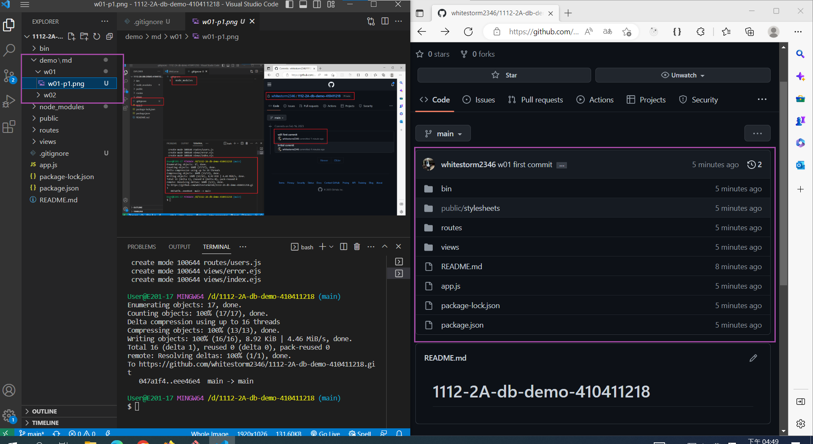

[My Github repo URL](https://github.com/whitestorm2346/1112-2A-db-demo-410411218)

### W01-P1: create github repo -- 1112-2A-db-demo-id, git push w01 files

### W01-P2: copy crown themes over to public folder, npm run dev, show localhost:3000

