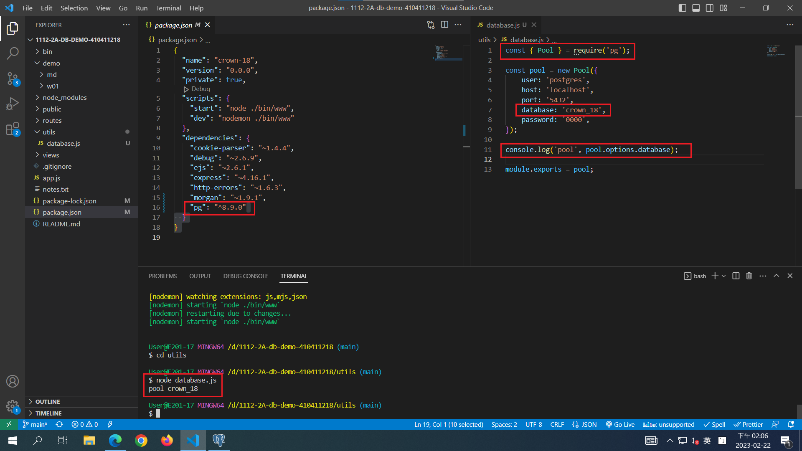
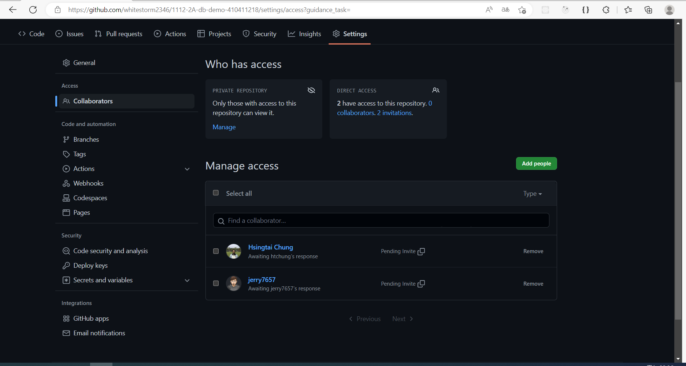
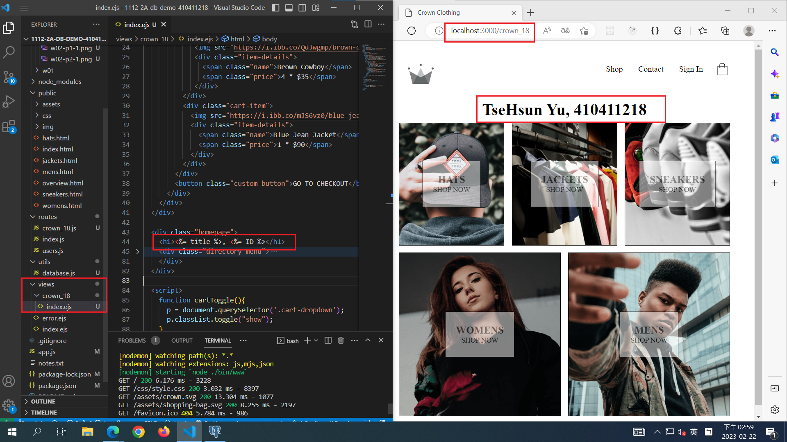
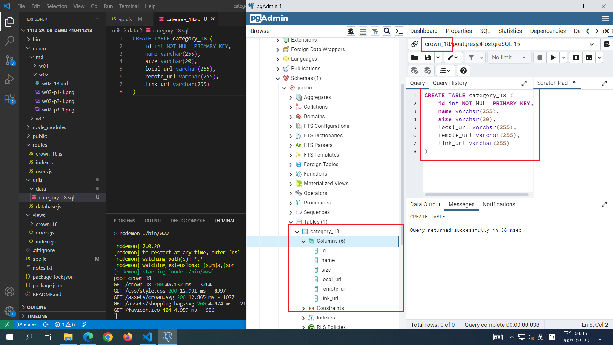
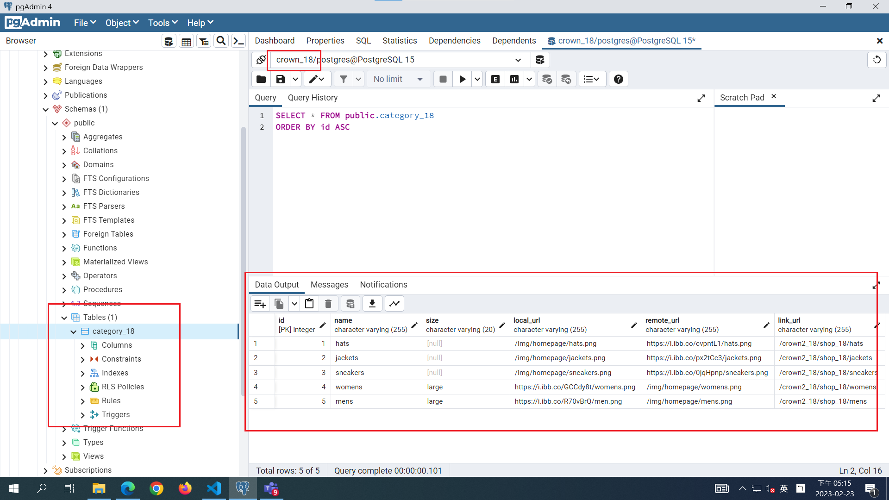
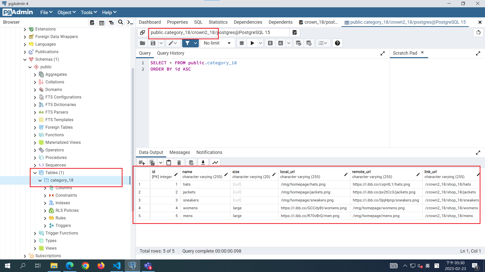

[My Github repo URL](https://github.com/whitestorm2346/1112-2A-db-demo-410411218)

### W02-P1: 資料庫連線及測試連線，要顯示資料庫 crown_18 名稱



### W02-P2: 邀請老師與助教



### W02-P3: 建立路由 /crown_18 顯示 crown_18/index.ejs



### W02-P4: create table crown_18 using SQL commands



### W02-P5: insert 5 data into category_18 using SQL command



### W02-P6: backup crown_18 database, and restore the data into another database crown2_18



### Github logs of Week 02

```
$ git log --pretty=format:"%h%x09%an%x09%ad%x09%s" --after="2023-02-21"
c9071c8 whitestorm2346  Thu Feb 23 17:36:28 2023 +0800  W02-P6: backup crown_18 database, and restore the data into another database crown2_18
a8377ff whitestorm2346  Thu Feb 23 17:19:04 2023 +0800  W02-P5: insert 5 data into category_xx using SQL command
97ecd05 whitestorm2346  Thu Feb 23 16:45:27 2023 +0800  W02-P4: create table crown_18 using SQL commands
61bbf30 whitestorm2346  Wed Feb 22 15:10:32 2023 +0800  W02-P3: 建立路由 /crown_18 顯示 crown_18/index.ejs
1647133 whitestorm2346  Wed Feb 22 15:02:46 2023 +0800  W02-P3: 建立路由 /crown_18 顯示 crown_18/index.ejs
0a6ad89 whitestorm2346  Wed Feb 22 13:23:41 2023 +0800  save the code into demo/w01
```
