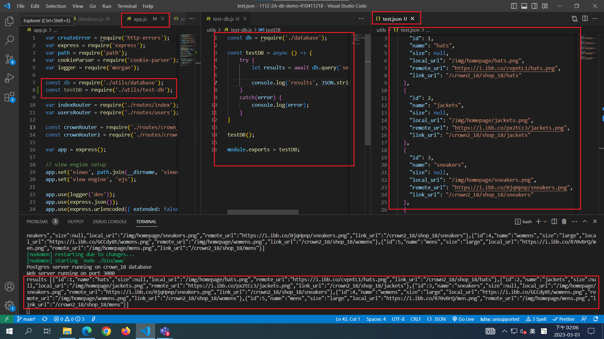
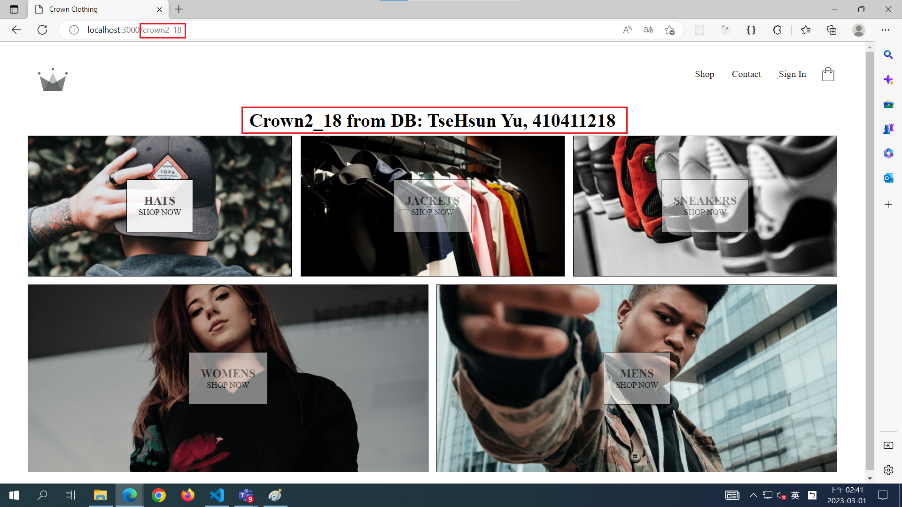
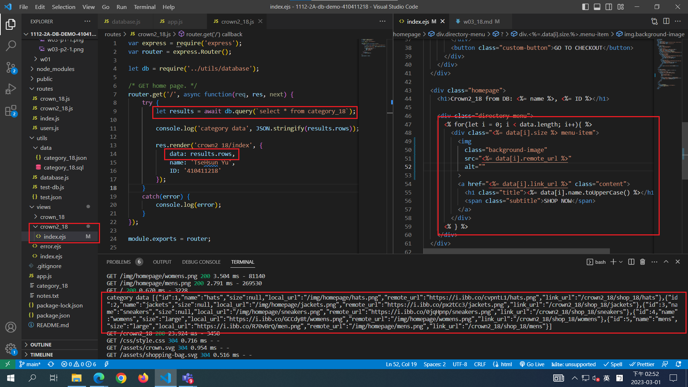
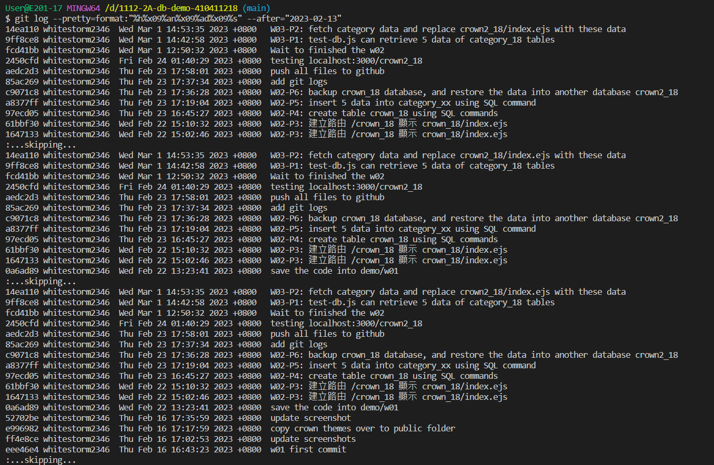

[My Github repo URL](https://github.com/whitestorm2346/1112-2A-db-demo-410411218)

### W03-P1: test-db.js can retrieve 5 data of category_18 tables



### W03-P2: fetch category data and replace crown2_18/index.ejs with these data





### Github logs of Week 01~03



```
$ git log --pretty=format:"%h%x09%an%x09%ad%x09%s" --after="2023-02-13"
14ea110 whitestorm2346  Wed Mar 1 14:53:35 2023 +0800   W03-P2: fetch category data and replace crown2_18/index.ejs with these data
9ff8ce8 whitestorm2346  Wed Mar 1 14:42:58 2023 +0800   W03-P1: test-db.js can retrieve 5 data of category_18 tables
fcd41bb whitestorm2346  Wed Mar 1 12:50:32 2023 +0800   Wait to finished the w02
2450cfd whitestorm2346  Fri Feb 24 01:40:29 2023 +0800  testing localhost:3000/crown2_18
aedc2d3 whitestorm2346  Thu Feb 23 17:58:01 2023 +0800  push all files to github
85ac269 whitestorm2346  Thu Feb 23 17:37:34 2023 +0800  add git logs
c9071c8 whitestorm2346  Thu Feb 23 17:36:28 2023 +0800  W02-P6: backup crown_18 database, and restore the data into another database crown2_18
a8377ff whitestorm2346  Thu Feb 23 17:19:04 2023 +0800  W02-P5: insert 5 data into category_xx using SQL command
97ecd05 whitestorm2346  Thu Feb 23 16:45:27 2023 +0800  W02-P4: create table crown_18 using SQL commands
61bbf30 whitestorm2346  Wed Feb 22 15:10:32 2023 +0800  W02-P3: 建立路由 /crown_18 顯示 crown_18/index.ejs
1647133 whitestorm2346  Wed Feb 22 15:02:46 2023 +0800  W02-P3: 建立路由 /crown_18 顯示 crown_18/index.ejs
:...skipping...
14ea110 whitestorm2346  Wed Mar 1 14:53:35 2023 +0800   W03-P2: fetch category data and replace crown2_18/index.ejs with these data
9ff8ce8 whitestorm2346  Wed Mar 1 14:42:58 2023 +0800   W03-P1: test-db.js can retrieve 5 data of category_18 tables
fcd41bb whitestorm2346  Wed Mar 1 12:50:32 2023 +0800   Wait to finished the w02
2450cfd whitestorm2346  Fri Feb 24 01:40:29 2023 +0800  testing localhost:3000/crown2_18
aedc2d3 whitestorm2346  Thu Feb 23 17:58:01 2023 +0800  push all files to github
85ac269 whitestorm2346  Thu Feb 23 17:37:34 2023 +0800  add git logs
c9071c8 whitestorm2346  Thu Feb 23 17:36:28 2023 +0800  W02-P6: backup crown_18 database, and restore the data into another database crown2_18
a8377ff whitestorm2346  Thu Feb 23 17:19:04 2023 +0800  W02-P5: insert 5 data into category_xx using SQL command
97ecd05 whitestorm2346  Thu Feb 23 16:45:27 2023 +0800  W02-P4: create table crown_18 using SQL commands
61bbf30 whitestorm2346  Wed Feb 22 15:10:32 2023 +0800  W02-P3: 建立路由 /crown_18 顯示 crown_18/index.ejs
1647133 whitestorm2346  Wed Feb 22 15:02:46 2023 +0800  W02-P3: 建立路由 /crown_18 顯示 crown_18/index.ejs
0a6ad89 whitestorm2346  Wed Feb 22 13:23:41 2023 +0800  save the code into demo/w01
:...skipping...
14ea110 whitestorm2346  Wed Mar 1 14:53:35 2023 +0800   W03-P2: fetch category data and replace crown2_18/index.ejs with these data
9ff8ce8 whitestorm2346  Wed Mar 1 14:42:58 2023 +0800   W03-P1: test-db.js can retrieve 5 data of category_18 tables
fcd41bb whitestorm2346  Wed Mar 1 12:50:32 2023 +0800   Wait to finished the w02
2450cfd whitestorm2346  Fri Feb 24 01:40:29 2023 +0800  testing localhost:3000/crown2_18
aedc2d3 whitestorm2346  Thu Feb 23 17:58:01 2023 +0800  push all files to github
85ac269 whitestorm2346  Thu Feb 23 17:37:34 2023 +0800  add git logs
c9071c8 whitestorm2346  Thu Feb 23 17:36:28 2023 +0800  W02-P6: backup crown_18 database, and restore the data into another database crown2_18
a8377ff whitestorm2346  Thu Feb 23 17:19:04 2023 +0800  W02-P5: insert 5 data into category_xx using SQL command
97ecd05 whitestorm2346  Thu Feb 23 16:45:27 2023 +0800  W02-P4: create table crown_18 using SQL commands
61bbf30 whitestorm2346  Wed Feb 22 15:10:32 2023 +0800  W02-P3: 建立路由 /crown_18 顯示 crown_18/index.ejs
1647133 whitestorm2346  Wed Feb 22 15:02:46 2023 +0800  W02-P3: 建立路由 /crown_18 顯示 crown_18/index.ejs
0a6ad89 whitestorm2346  Wed Feb 22 13:23:41 2023 +0800  save the code into demo/w01
52702be whitestorm2346  Thu Feb 16 17:35:59 2023 +0800  update screenshot
e996982 whitestorm2346  Thu Feb 16 17:17:59 2023 +0800  copy crown themes over to public folder
ff4e8ce whitestorm2346  Thu Feb 16 17:02:53 2023 +0800  update screenshots
eee46e4 whitestorm2346  Thu Feb 16 16:43:23 2023 +0800  w01 first commit
```
