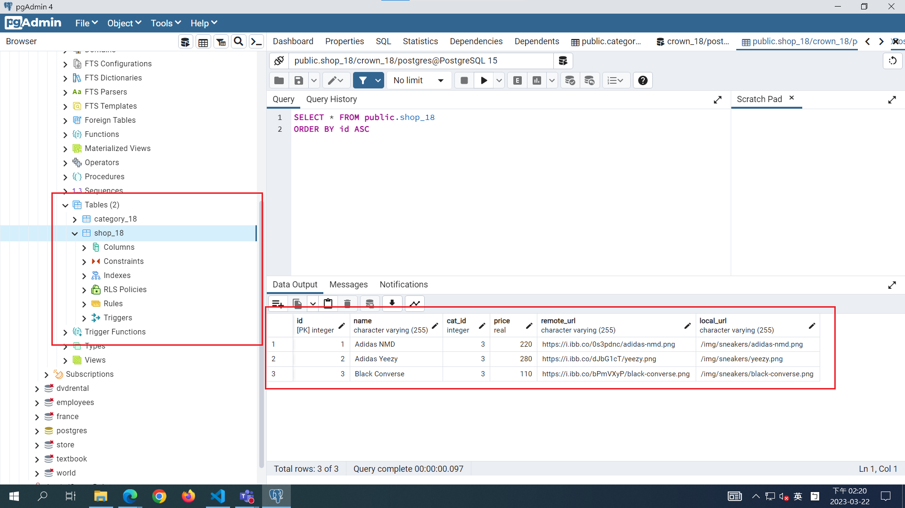
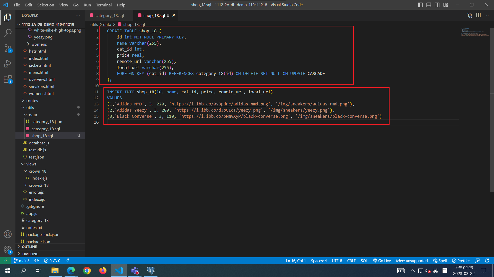
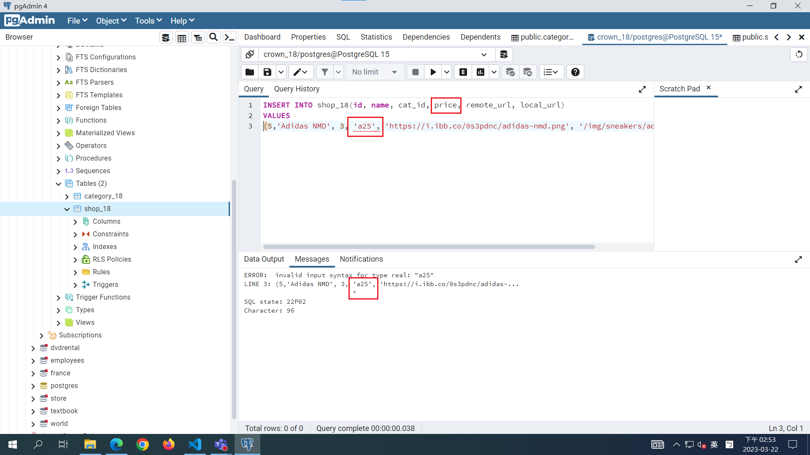
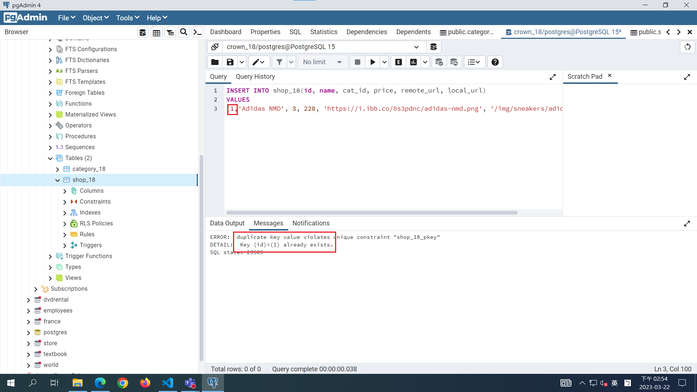
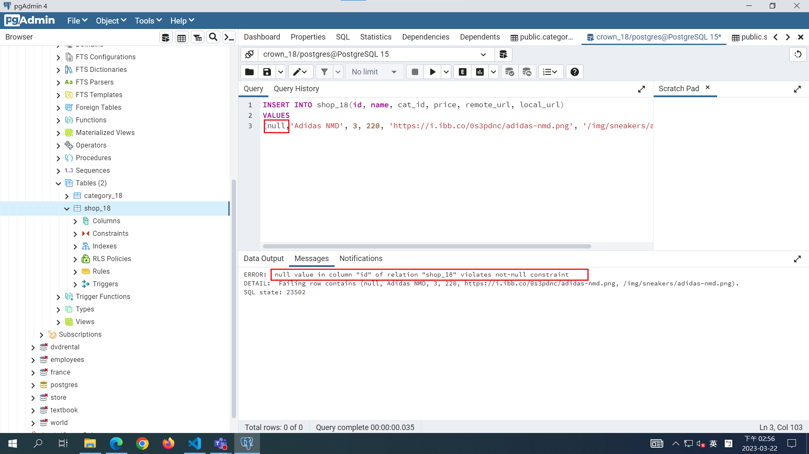
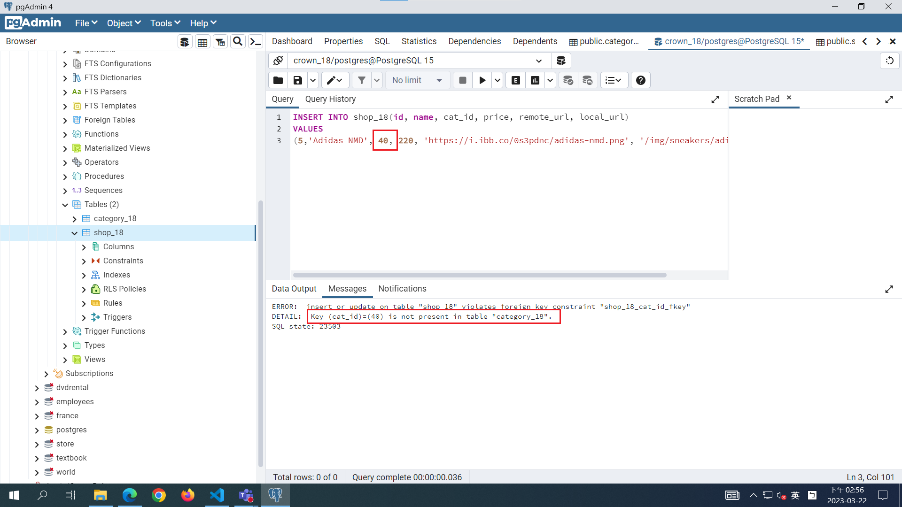
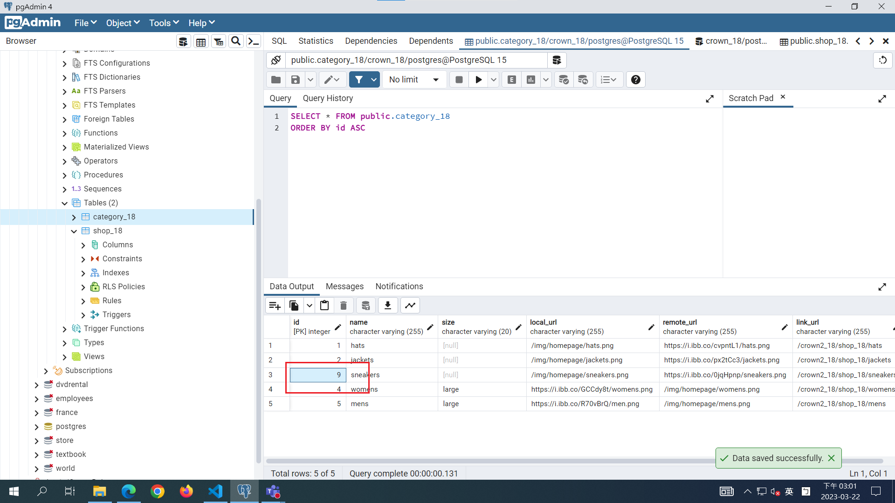
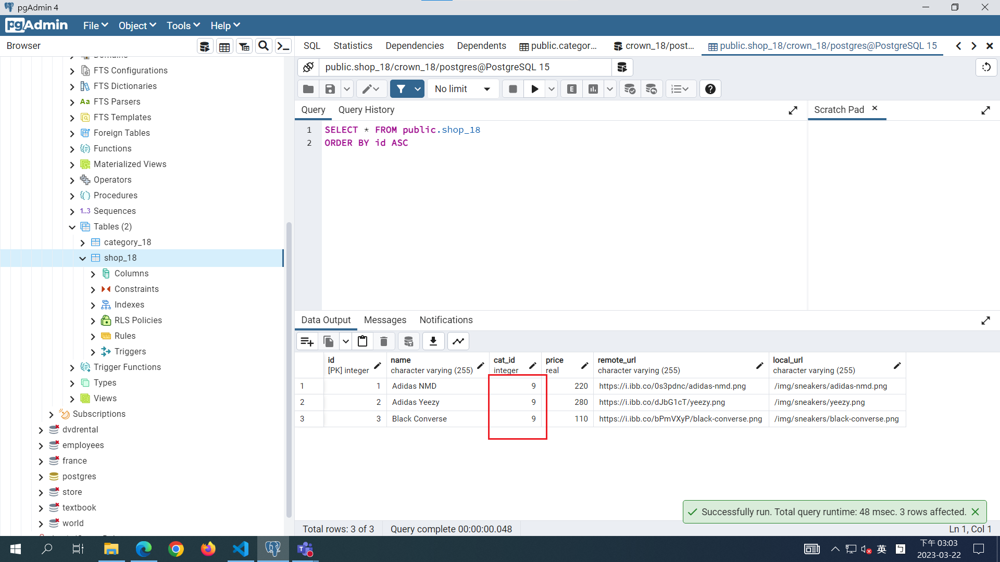
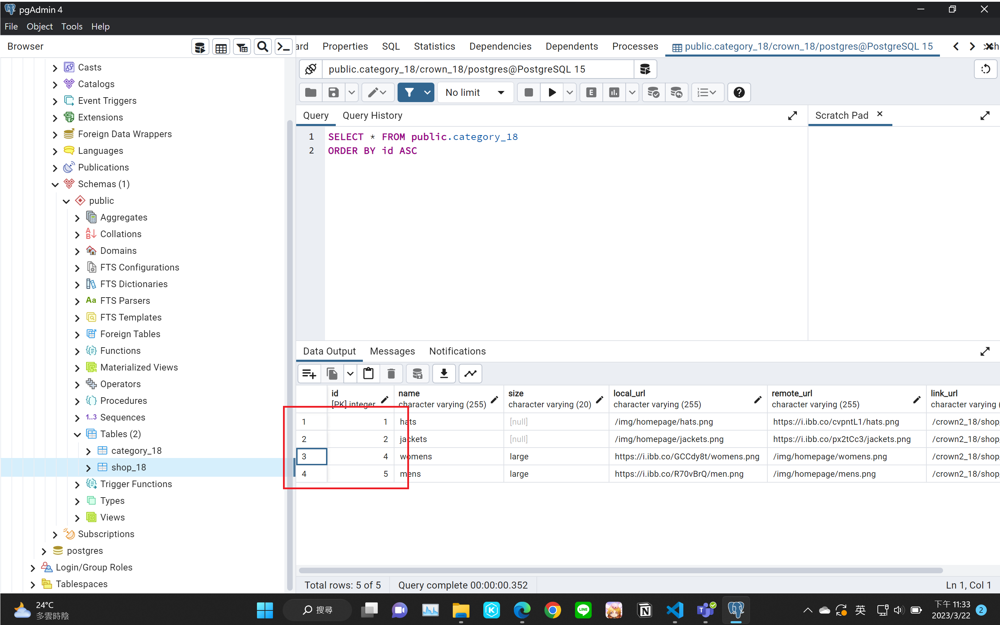
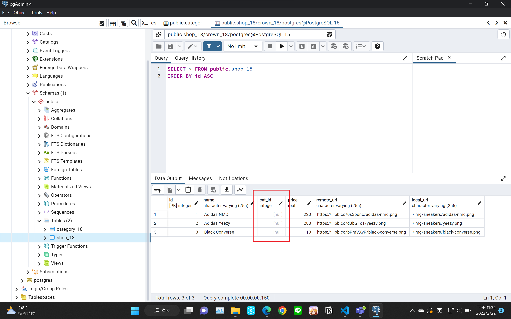

[My Github repo URL](https://github.com/whitestorm2346/1112-2A-db-demo-410411218)

### W06-P1: use SQL command to create shop_18 with 3 data





### W06-P2: Relational Model Constraints

定義域限制 (domain constrain)


關聯鍵限制 (primary key constrain)


實體完整限制 (entity integrity constrain)


參考完整限制 (referential integrity constrain)


### W06-P3: ON UPDATE CASCADE





### W06-P4: ON DELETE SET NULL





### Github logs of Week 06


```
$ git log --pretty=format:"%h%x09%an%x09%ad%x09%s" --after="2023-03-20"

dacea23 whitestorm2346  Wed Mar 22 23:46:26 2023 +0800  Finished W06 all part and w06_18.md
f8904df whitestorm2346  Wed Mar 22 15:06:06 2023 +0800  w06 unfinished
```
