[My Github repo URL](https://github.com/whitestorm2346/1112-2A-db-demo-410411218)

### W09-P1: Midprep P1 answer

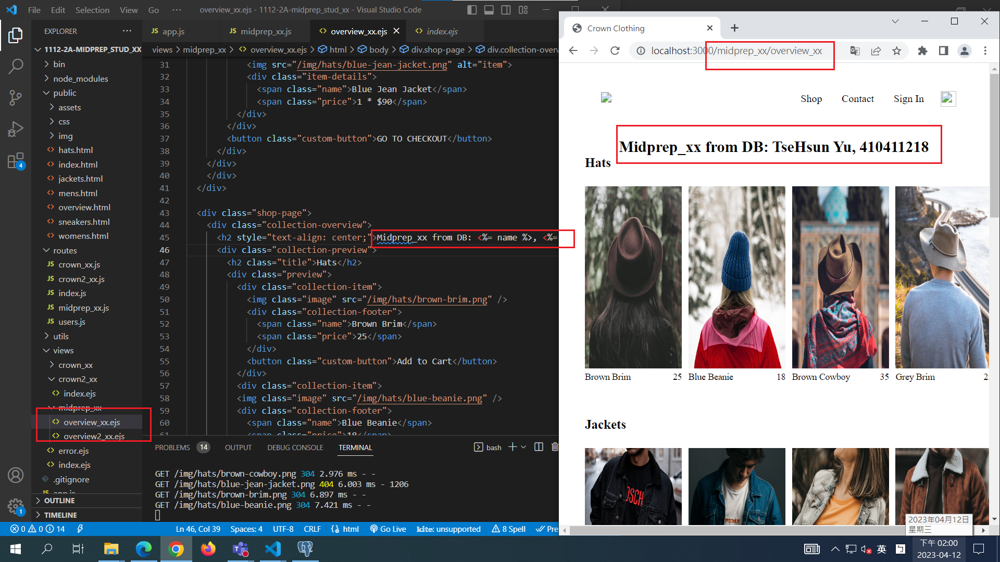

### W09-P2: Midprep P2 answer

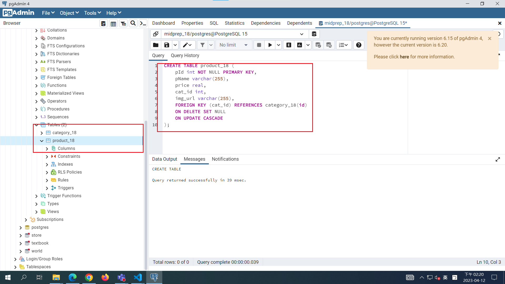

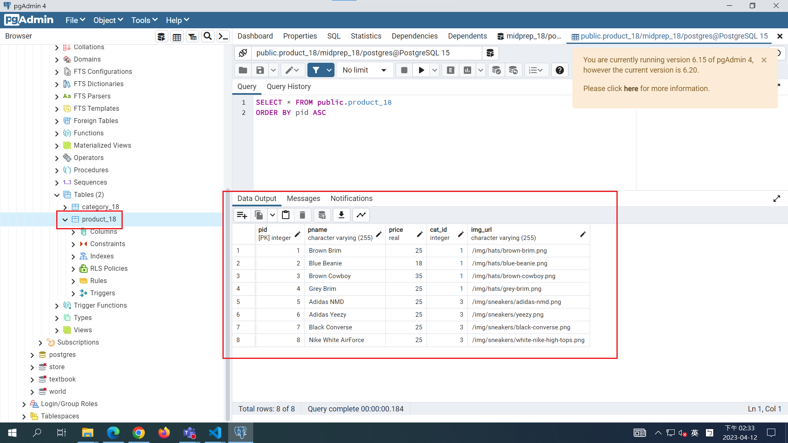

### W09-P3: Midprep P3 answer

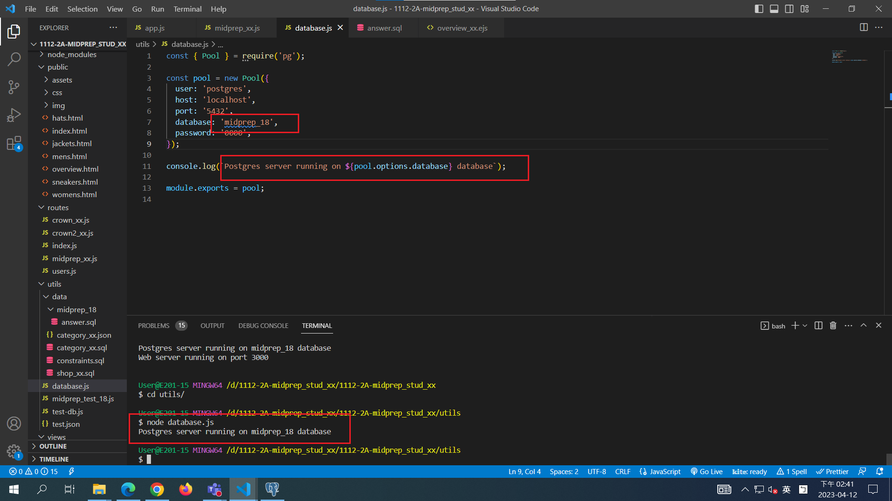

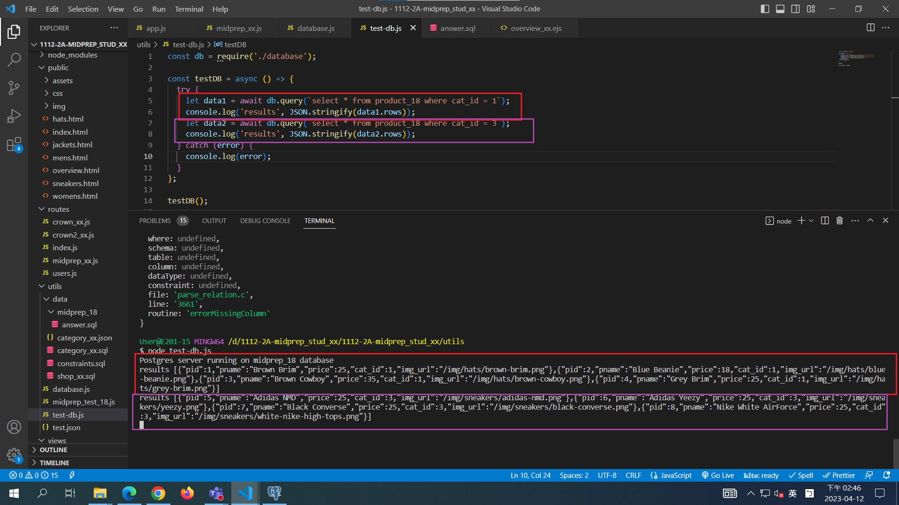

### W09-P4: Midprep P4 answer

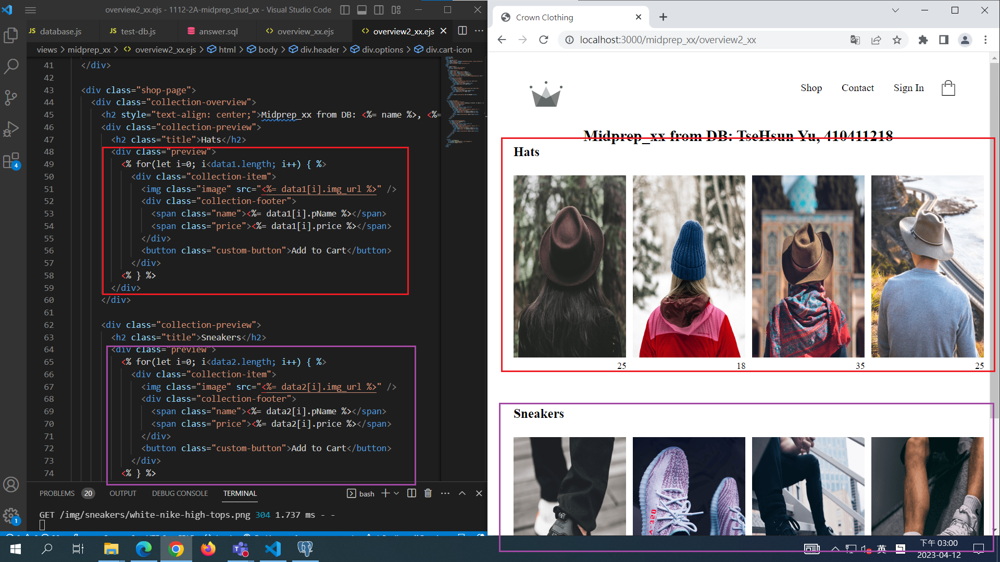

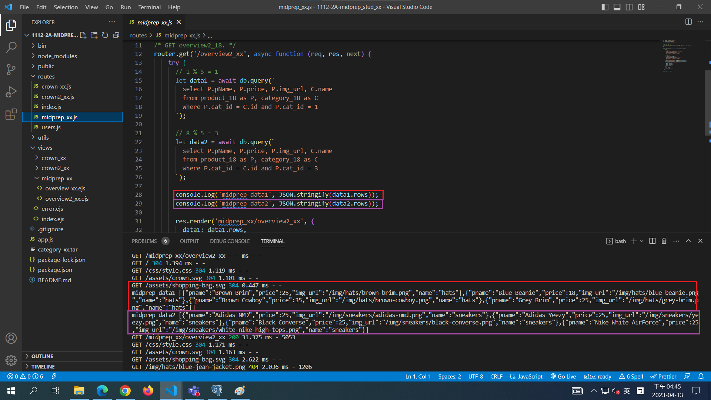

### W09-P5: ON UPDATE CASCADE

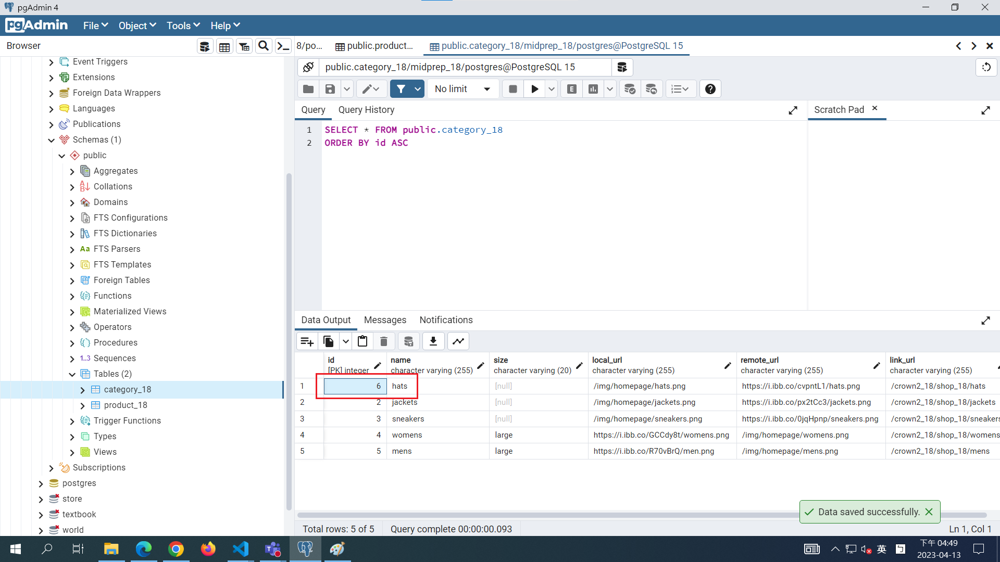

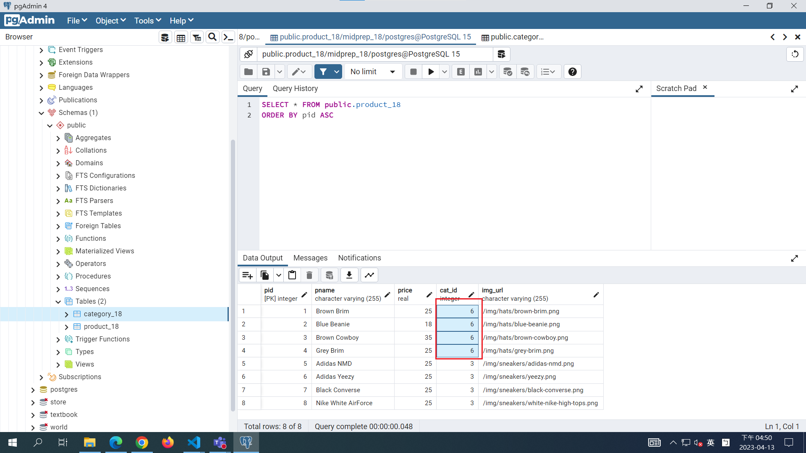

### W09-P6: ON DELETE SET NULL

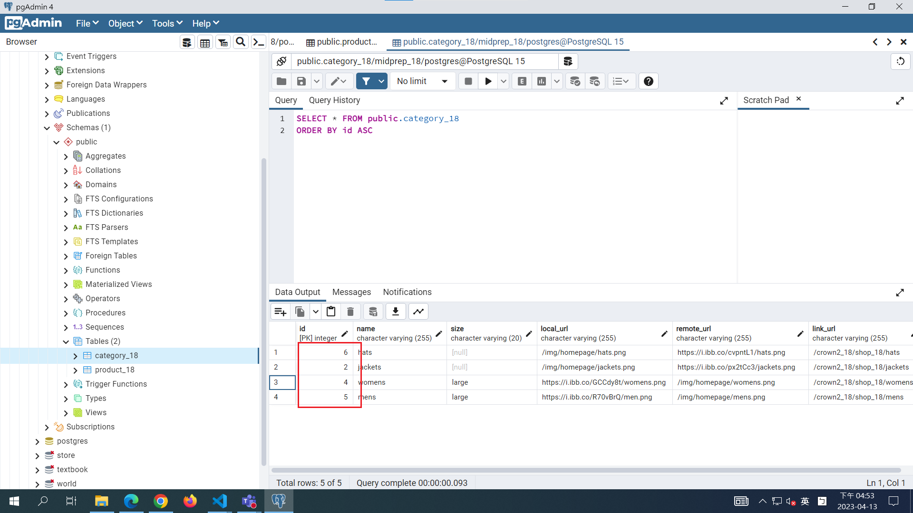

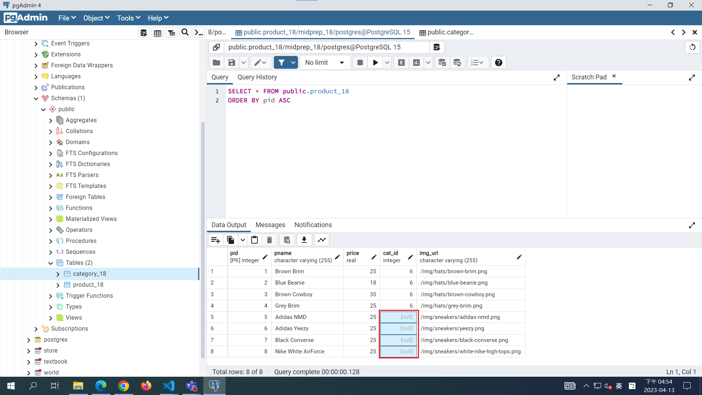
